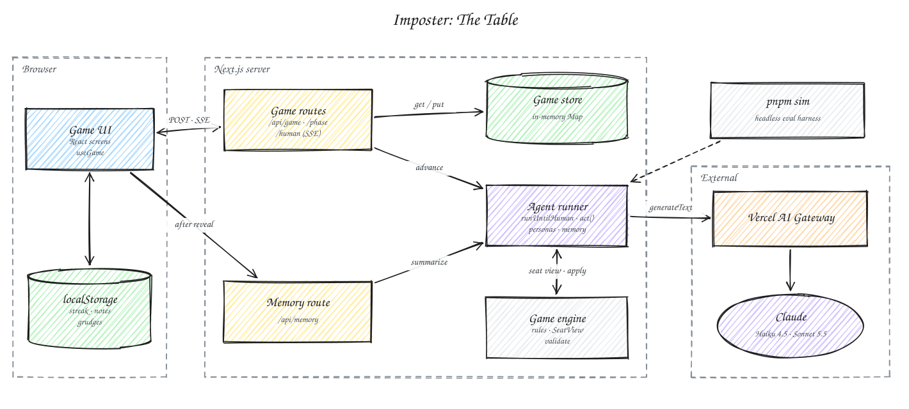

# Imposter: The Table

A daily social deduction word game where you sit at a table with AI players who have secrets, personalities, and grudges.

Everyone gets the secret word except one imposter, who only knows the category. Two rounds of one-word clues, a short argument, a vote. The AI players are real players, not a referee: a pure TypeScript engine owns the rules and hidden information, and each Claude-backed agent only ever sees what its seat is allowed to know. Built for the Hivemind Winter '27 take-home.

## Play it

- **Live:** _deployment link pending_
- **Local:** see [Getting started](#getting-started).

Phone width is the intended layout. **Play** puts you at the table with Juno, Biscuit, and Marlowe. **Watch** seats Juno, Biscuit, Marlowe, and Rook and has you call the imposter before they do.

Submission status ([plan §01](docs/plan.md#01-scope-and-definition-of-done) and [§13](docs/plan.md#13-deliverables)); the [validation log](docs/validation.md) has the detail:

| Item | Status |
| --- | --- |
| Deployed URL | pending |
| One full round on a physical phone with no console errors | not tested; rounds so far ran in a 375×812 browser pane |
| Three rounds in a row | not tested |
| Sim table with real numbers | pending; the gateway account refuses calls until a card is on file |
| Loom against the deployed URL | not recorded |

## Architecture



- **Game UI** (`src/components/`): React screens driven by the `useGame` hook. Creates a table with `POST /api/game`, then reads each phase as a stream of server-sent events. Streak, history, persona notes, and grudges live in **localStorage** (`src/lib/local.ts`), keyed by a random player id.
- **Game routes** (`src/app/api/game/…`): thin handlers over `src/lib/game-service.ts`. `POST /api/game` deals, `GET /api/game/[id]` resumes, `POST /api/game/[id]/phase` and `POST /api/game/[id]/human` run turns and stream `GameEvent`s until a human move is needed ([ADR 0007](docs/adr/0007-sse-and-in-memory-store.md)).
- **Game store** (`src/lib/store.ts`): an in-memory `Map` on `globalThis` with a 2-hour TTL and a per-game lock so two requests can't advance the same table. A recycled instance shows "Table reset. Deal again."
- **Agent runner** (`src/agents/`): `runUntilHuman` steps through agent turns; `act()` builds the seat view, calls the model with a Zod schema per phase, validates, retries once, and falls back. Persona knobs change decisions after the model answers. `memory.ts` writes post-game notes per persona.
- **Game engine** (`src/engine/`): pure TypeScript rules, phases, the daily word bank, `SeatView` construction, and clue/vote validation. No framework imports; shared by routes, tests, and the simulator.
- **Memory route** (`POST /api/memory`): after the reveal, summarizes the server's own copy of the game for each persona (cached, at most three attempts per game) so one client can't shape another's memory.
- **Vercel AI Gateway → Claude**: every model call is `generateText` with structured output, a 12 s timeout, and no SDK retries. Haiku 4.5 plays civilians, Sonnet 5.5 plays the imposter.
- **`pnpm sim`** (`scripts/sim.ts`): headless four-agent games through the same runner, printing the eval table below.

### How the agent decides

The code is the referee and the model only gets a seat ([ADR 0002](docs/adr/0002-code-referees-model-plays.md)).

1. **Seat view.** When a seat must act, the engine builds a `SeatView` with only what that seat may know. For the imposter, `word` is `null`. The secret word is never in its prompt; a [test](src/agents/agents.test.ts) checks every prompt the imposter receives across all seats, and another [test](src/engine/game.test.ts) checks the serialized view for every word set.
2. **Structured move.** One model call per turn. Civilians return three candidate clues from vague to specific. The imposter returns a probability list of what the word might be, then a clue that fits its top guesses. Every move except the caught imposter's last guess carries a private note and a suspicion score for each other player.
3. **Validation.** The engine checks the answer (one word, not the word or its stem, no repeats). A rejected clue is retried once with the reason; after that the agent plays a flagged safe fallback. A failed or slow call never stalls the game.
4. **Personality in code, not just tone** ([ADR 0005](docs/adr/0005-personas-change-decisions.md)). *Specificity* picks which of the three candidates is played (Juno plays the specific one, Biscuit the vague one). *Update rate* blends new suspicion with the old (Juno moves slowly, Biscuit flips every clue). *Chaos* sometimes sends a vote to the second suspect and logs it as a hunch.
5. **Memory.** After each game, a short call per persona writes up to three notes about your play style plus a lobby line. Those notes and a grudge counter go into the next game's prompt.

### Model and why

Claude through the Vercel AI Gateway ([ADR 0004](docs/adr/0004-claude-via-ai-gateway.md)): **Haiku 4.5** for civilian turns and **Sonnet 5.5** for the imposter seat.

- The engine depends on strict structured output every turn, so schema-following matters more than prose quality.
- Bluffing and inferring the word are the hardest reasoning in the game, and they all happen in one seat, so that seat gets the stronger model.
- Three agents act every phase, so the rest run on the fast, cheap model, in parallel where the rules allow.

The split is meant to be justified by measurement, not assertion: `pnpm sim` plays headless four-agent games and prints this table.

| Config (civilian / imposter) | Imposter win rate | Caught but guessed | Clue rejections | Fallback moves | Avg turn latency | Cost / game |
| --- | --- | --- | --- | --- | --- | --- |
| haiku-4.5 / sonnet-5.5 | _pending_ | | | | | |
| haiku-4.5 / haiku-4.5 | _pending_ | | | | | |
| sonnet-5.5 / sonnet-5.5 | _pending_ | | | | | |

_Pending: the gateway account currently refuses requests until a card is on file (`403 customer_verification_required`). Targets from [plan §11](docs/plan.md#11-eval-harness-and-model-pick): imposter win rate 35–50%, clue rejections under 10%, vote accuracy Juno > Rook > Biscuit, average turn under 2.5 s._

## Features

- **Daily table.** A new word set every day (30 hand-written sets with close decoys), a streak, and a share card.
- **Agents with memory.** Personas remember how you play and hold grudges when you vote for them and they weren't the imposter.
- **Brain Replay.** After every reveal: each agent's private note per turn, a sparkline of its suspicion of the real imposter, and the imposter's running guesses at the word. Locked until the reveal so it can't spoil a round ([ADR 0006](docs/adr/0006-brain-replay-after-reveal.md)).
- **Watch mode.** Four agents play each other while you try to call the imposter early for more points, with a live table-average read; you can take over a seat mid-game.
- **Streamed turns.** Clues and votes land one at a time over SSE, no sockets.
- **Graceful degradation.** Without a working gateway key the game still plays end to end on flagged fallback moves.

### Deliberate design choices

- **Code referees, model plays.** Hidden information is enforced by what's in the prompt, not by asking the model to behave.
- **Flawed on purpose.** Personas have tells and hunches so the imposter has a real chance and the table feels like people.
- **Ties favor the imposter.** That makes "I'm sure" and every vote matter.
- **One dark theme, three type sizes** plus a mono label ([ADR 0008](docs/adr/0008-design-system-from-jasonyuan-design.md)). Players are 8px dots. Red appears in exactly four places: the imposter's role card, the live dot in Watch mode, an invalid clue border, and the Deal button.
- **In-memory game store for v1.** A KV store is the first upgrade.

## Tech stack

Next.js 16 (App Router), React 19, AI SDK 7 with the Vercel AI Gateway, Zod 4, Tailwind CSS 4, TypeScript, Vitest, tsx, GitHub Actions. pnpm, Node 22+. Built for Vercel.

## Getting started

```sh
pnpm install
cp .env.example .env.local   # then add AI_GATEWAY_API_KEY
pnpm dev                     # http://localhost:3000
```

Environment variables read by the code:

| Variable | Purpose |
| --- | --- |
| `AI_GATEWAY_API_KEY` | Vercel AI Gateway key, read by the AI SDK. Required for real agent turns and `pnpm sim`. |
| `MODEL_CIVILIAN` | Optional override for civilian turns (default `anthropic/claude-haiku-4.5`). |
| `MODEL_IMPOSTER` | Optional override for the imposter seat (default `anthropic/claude-sonnet-5.5`). |
| `MODEL_MEMORY` | Optional override for post-game memory notes (default `anthropic/claude-haiku-4.5`). |

Other commands:

```sh
pnpm check      # typecheck, lint, tests, build
pnpm test       # engine and agent tests (scripted model, no network)
pnpm sim -- --games 10 --civ anthropic/claude-haiku-4.5 --imp anthropic/claude-sonnet-5.5
```

`pnpm sim` also takes `--concurrency N` and `--verbose` (print each game's transcript). Each run prints one row of the table above, so the full table takes three runs with different `--civ` / `--imp` pairs.

## Project structure

```
src/
  app/          layout, page, and API routes (api/game, api/game/[id]/{phase,human}, api/memory)
  components/   screens, useGame, ui/ primitives
  agents/       prompts, schemas, act(), runner, personas, memory
  engine/       pure rules, views, validation, daily word bank, tests
  lib/          game service, SSE, in-memory store, localStorage, outcome
scripts/sim.ts  headless eval harness
docs/           plan, ADRs, CI notes, validation log, architecture diagram
```

More detail: [plan](docs/plan.md), [ADRs](docs/adr/README.md), [CI](docs/ci.md), [validation log](docs/validation.md).

## What I'd do next

- Voice mode for the living room: one phone as the table, everyone speaks their clue.
- Friends and agents at the same table, with agents filling empty seats.
- An interrogation mode (Alibi): three agent suspects share a story and one is lying.
- Persona tuning from Watch-mode tournaments, using the sim's win rates and vote accuracy as the objective.
- KV persistence and cross-device memory.
